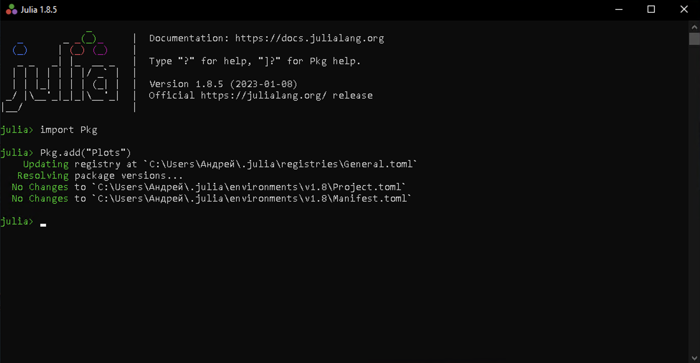
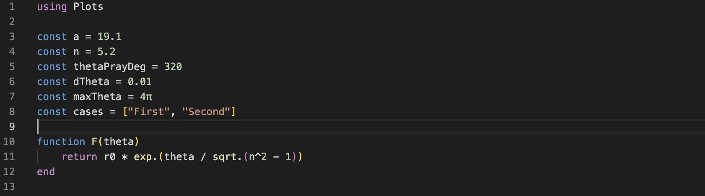
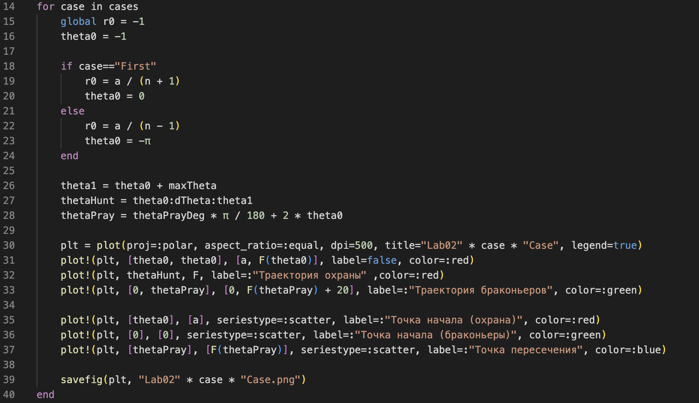
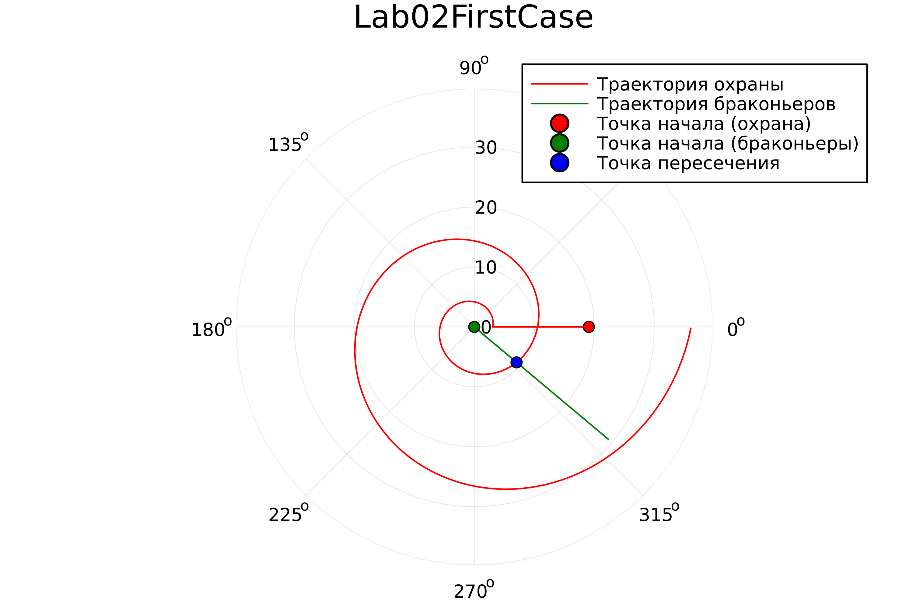
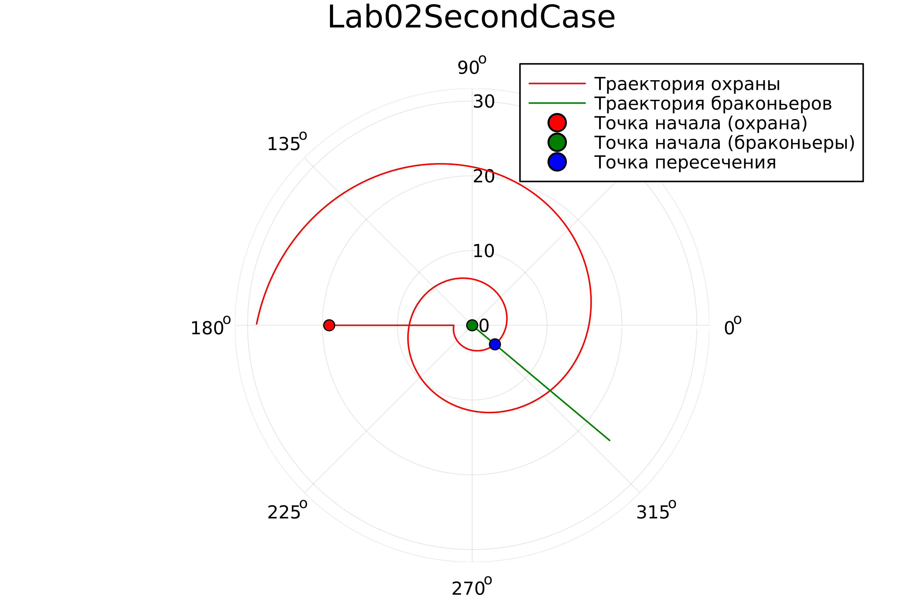

---
## Front matter
lang: ru-RU
title: Лабораторная работа №2
author: Ибрагимов Улугбек Ботырхонович
institute: 2023, Москва
date: НФИбд-03-20

## Formatting
toc: false
slide_level: 2
theme: metropolis
header-includes: 
 - \metroset{progressbar=frametitle,sectionpage=progressbar,numbering=fraction}
 - '\makeatletter'
 - '\beamer@ignorenonframefalse'
 - '\makeatother'
aspectratio: 43
section-titles: true
---

# Введение

## Прагматика

Приобрести необхдимые в современном научном сообществе навыки моделирования задач.

## Цель

Решить задачу о погоне. Смоделировать кривую погони средствами Julia и OpenModelica.

## Задачи

1. Провести рассуждения аналогичные инструцкии и вывод дифференциальных уравнений, если скорость катера больше скорости лодки в n раз.
2. Построить траекторию движения катера и лодки для двух случаев.
3. Определить по графику точку пересечения катера и лодки

# Выполнение

## Формулы (1)

Пусть 

* n - разница в скорости, то есть скорость катера в n раз больше лодки;

* a - расстояние между катером и лодкой в момент рассеивания тумана.

## Формулы (2)

Тогда общие начальные условия для первого случая выглядят следующим образом:
$$
\left\{ 
\begin{array}{c}
\theta_0 = 0 \\ 
r_0 = \frac{a}{(n + 1)}
\end{array}
\right. 
$$

Для второго случая:
$$
\left\{ 
\begin{array}{c}
\theta_0 = -\pi \\ 
r_0 = \frac{a}{(n - 1)}
\end{array}
\right. 
$$

Уравнение кривой в общем случае выглядит следующим образом:
$$r(\theta) = r_0 e ^ {\frac{\theta}{\sqrt{n^2 - 1}}}$$

## Plots

   

## Script (1)

   

## Script (1)

   

## Case (1)

   

## Case (2)

   

# Результаты

## Итог

Мы улучшили практичесские навыки в области дифференциальных уравнений, а также приобрели нвыки моделирования на Julia.

## {.standout}

Спасибо за внимание!
