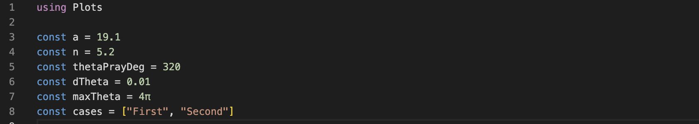

---
# Front matter
lang: ru-RU
title: Лабораторная работа №2
subtitle: Задача о погоне
author: Ибрагимов Улугбек Ботырхонович

## Bibliography
bibliography: bib/cite.bib
csl: pandoc/csl/gost-r-7-0-5-2008-numeric.csl

# Formatting
toc-title: "Содержание"
toc: true # Table of contents
toc_depth: 2
lof: true # Список изображений
lot: false # List of tables
fontsize: 12pt
linestretch: 1.5
papersize: a4paper
documentclass: scrreprt
polyglossia-lang: russian
polyglossia-otherlangs: english
mainfont: PT Serif
romanfont: PT Serif
sansfont: PT Sans
monofont: PT Mono
mainfontoptions: Ligatures=TeX
romanfontoptions: Ligatures=TeX
sansfontoptions: Ligatures=TeX,Scale=MatchLowercase
monofontoptions: Scale=MatchLowercase
biblatex: true
biblio-style: "gost-numeric"
biblatexoptions:
    - parentracker=true
    - backend=biber
    - hyperref=auto
    - language=auto
    - autolang=other*
    - citestyle=gost-numeric
indent: true
pdf-engine: lualatex
header-includes:
    - \linepenalty=10 # the penalty added to the badness of each line within a paragraph (no associated penalty node) Increasing the value makes tex try to have fewer lines in the paragraph.
    - \interlinepenalty=0 # value of the penalty (node) added after each line of a paragraph.
    - \hyphenpenalty=50 # the penalty for line breaking at an automatically inserted hyphen
    - \exhyphenpenalty=50 # the penalty for line breaking at an explicit hyphen
    - \binoppenalty=700 # the penalty for breaking a line at a binary operator
    - \relpenalty=500 # the penalty for breaking a line at a relation
    - \clubpenalty=150 # extra penalty for breaking after first line of a paragraph
    - \widowpenalty=150 # extra penalty for breaking before last line of a paragraph
    - \displaywidowpenalty=50 # extra penalty for breaking before last line before a display math
    - \brokenpenalty=100 # extra penalty for page breaking after a hyphenated line
    - \predisplaypenalty=10000 # penalty for breaking before a display
    - \postdisplaypenalty=0 # penalty for breaking after a display
    - \floatingpenalty = 20000 # penalty for splitting an insertion (can only be split footnote in standard LaTeX)
    - \raggedbottom # or \flushbottom
    - \usepackage{float} # keep figures where there are in the text
    - \floatplacement{figure}{H} # keep figures where there are in the text
---

# Цель работы

Решить задачу о погоне. Смоделировать кривую погони средствами Julia и OpenModelica.

# Задачи

1. Провести аналогичные рассуждения и вывод дифференциальных уравнений, если скорость катера больше скорости лодки в n раз.
2. Построить траекторию движения катера и лодки для двух случаев.
3. Определить по графику точку пересечения катера и лодки

# Термины

* Задача о погоне — классических задача из области дифференциальных уравнений. [1]

* Кривая погони — кривая, представляющая собой решение задачи о «погоне». [2]

* Julia – это открытый свободный высокопроизводительный динамический язык высокого уровня, созданный специально для технических (математических) вычислений. Его синтаксис близок к синтаксису других сред технических вычислений, таких как Matlab и Octave. [3]

* OpenModelica — свободное открытое программное обеспечение для моделирования, симуляции, оптимизации и анализа сложных динамических систем. Основано на языке Modelica. [4]

# Теоретическая справка
Для построения кривой погони, нам необходимо знать начальные условия и уравнения кривой. Ориентируясь на рассуждения из пособия к лабораторной работы[1] можно вывести общие формулы. Благодаря общим формулам можно будет написать программу, которая будет строить разные кривые погони в зависимости от исходных данных (расстояния и разницы в скорости).

Пусть 

* n - разница в скорости, то есть скорость катера в n раз больше лодки;

* a - расстояние между катером и лодкой в момент рассеивания тумана.

Тогда общие начальные условия для первого случая выглядят следующим образом:
$$
\left\{ 
\begin{array}{c}
\theta_0 = 0 \\ 
r_0 = \frac{a}{(n + 1)}
\end{array}
\right. 
$$

Для второго случая:
$$
\left\{ 
\begin{array}{c}
\theta_0 = -\pi \\ 
r_0 = \frac{a}{(n - 1)}
\end{array}
\right. 
$$

Уравнение кривой в общем случае выглядит следующим образом:
$$r(\theta) = r_0 e ^ {\frac{\theta}{\sqrt{n^2 - 1}}}$$


# Выполнение лабораторной работы.

1. Установим пакет в Julia необходимый для построения графика. (Рис. 1)

```Julia
import Pkg
Pkg.add("Plots")
```


2. Приступим к написанию скрипта. Первым делом подкючим пакет "Plots" и объявим необходимые константы. Константа `a` и `n` - являются входными данными, `thetaPrayDeg` - сторона в которую поплыла лодка,  `dTheta` - шаг для равномерного разбиения периода, `maxTheta` - длина периода построения, `cases` - содержит два кейса, по которым мы будем итерироваться. (Рис. 2)

```Julia
using ... # используется для поключения пакета
const ... # используется для объявления константы
```



3. Напишем функцию, которая будет являтся уравнением нашей кривой. (Рис. 3)

```Julia
# синтаксис функции
function funcName(args)
    #script
end
```


4. Дальше откроем цикл, внутри которого будем итерироваться по двум кейсам (в данных кейсах разные начальные условия). Для написания цикла используем следующую конструкцию (Рис. 4):

```Julia
# синтаксис цикла
for item in list
    #script
end
```


5. Внутри цикла сначла определим начальные условия в зависимости от кейса. Для этого воспользуемся ветвлением (Рис. 5): 

```Julia
# синтаксис ветвления
if condition
  ...
else
  ...
end
```


6. После этого нам необходимо равномерно разбить наш период на точки (чем ментше расстояние между точками, тем кривая погони). Также необходимо перевести градус побега лодки в радианы с учетом начального условия. (Рис. 6) 

```Julia
# синтаксис разбиения
linspace = start:step:end
```


7. Построим необходимые графики и сохраним "полотно". (Рис. 7)


8. Просмотрим вывод программы (Рис. 8 - 9)


9. Построение кривой погони для данной задачи выполнять на OpenModelica стандартными инструментами невозможно. Так как в стандартные инструменты не выходит построение графиков в полярных координатах, в связи с этим данную лабораторную работу выполнять на OpenModelica нет необходимости.

# Листинг
```Julia
using Plots

const a = 19.1
const n = 5.2
const thetaPrayDeg = 320
const dTheta = 0.01
const maxTheta = 4pi
const cases = ["First", "Second"]

function F(theta)
    return r0 * exp.(theta / sqrt.(n^2 - 1))
end

for case in cases
    global r0 = -1
    theta0 = -1

    if case=="First"
        r0 = a / (n + 1)
        theta0 = 0
    else
        r0 = a / (n - 1)
        theta0 = -pi
    end

    theta1 = theta0 + maxTheta
    thetaHunt = theta0:dTheta:theta1
    thetaPray = thetaPrayDeg * pi / 180 + 2 * theta0

    plt = plot(proj=:polar, aspect_ratio=:equal, dpi=500, title="Lab02" * case * "Case", legend=true)
    plot!(plt, [theta0, theta0], [a, F(theta0)], label=false, color=:red)
    plot!(plt, thetaHunt, F, label=:"Траектория охраны" ,color=:red)
    plot!(plt, [0, thetaPray], [0, F(thetaPray) + 20], label=:"Траектория браконьеров", color=:green)

    plot!(plt, [theta0], [a], seriestype=:scatter, label=:"Точка начала (охрана)", color=:red)
    plot!(plt, [0], [0], seriestype=:scatter, label=:"Точка начала (браконьеры)", color=:green)
    plot!(plt, [thetaPray], [F(thetaPray)], seriestype=:scatter, label=:"Точка пересечения", color=:blue)

    savefig(plt, "Lab02" * case * "Case.png")
end
```

# Анализ результатов

Работа выполненна без непредвиденных проблем в соответствии с руководством. Ошибок и сбоев не произошло.

# Выводы

Мы улучшили практичесские навыки в области дифференциальных уравнений, а также приобрели нвыки моделирования на Julia.

# Библиография

* [1] Задача о погоне (https://esystem.rudn.ru/mod/resource/view.php?id=967233)

* [2] Кривая погони (https://ru.wikipedia.org/wiki/%D0%9A%D1%80%D0%B8%D0%B2%D0%B0%D1%8F_%D0%BF%D0%BE%D0%B3%D0%BE%D0%BD%D0%B8)

* [3] Julia (http://www.unn.ru/books/met_files/JULIA_tutorial.pdf)

* [4] OpenModelica (https://ru.wikipedia.org/wiki/OpenModelica)


