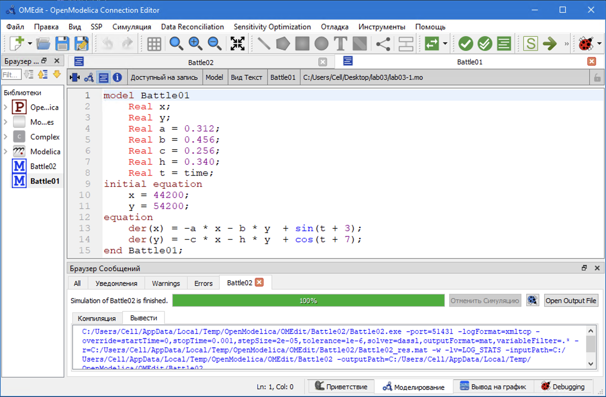

---
## Front matter
lang: ru-RU
title: Лабораторная работа №3
subtitle: Модель боевых действий
author: Ибрагимов Улугбек Ботырхонович
institute: Российский университет дружбы народов, Москва, Россия

## i18n babel
babel-lang: russian
babel-otherlangs: english

## Fonts
mainfont: PT Serif
romanfont: PT Serif
sansfont: PT Sans
monofont: PT Mono
mainfontoptions: Ligatures=TeX
romanfontoptions: Ligatures=TeX
sansfontoptions: Ligatures=TeX,Scale=MatchLowercase
monofontoptions: Scale=MatchLowercase,Scale=0.9

## Formatting pdf
toc: false
toc-title: Содержание
slide_level: 2
aspectratio: 169
section-titles: true
theme: metropolis
header-includes:
    - \metroset{progressbar=frametitle,sectionpage=progressbar,numbering=fraction}
    - '\makeatletter'
    - '\beamer@ignorenonframefalse'
    - '\makeatother'
---

# Информация

## Докладчик

:::::::::::::: {.columns align=center}
::: {.column width="70%"}

-   Ибрагимов Улугбек Ботырхонович
-   НФИбд-02-20
-   1032204510
-   Российский Университет Дружбы Народов
-   [1032204510@pfur.ru](mailto:1032204510@pfur.ru)
-   <https://github.com/gkwd>

:::
::: {.column width="30%"}

:::
::::::::::::::

# Вводная часть

## Актуальность

-   Приобрести необхдимые в современном научном сообществе навыки моделирования задач.
-   Освоить средства моделирования, такие как Julia и OpenModelica

## Объект и предмет исследования

-   Язык программирования Julia
-   OpenModelica
-   Модели Ланчестера

## Цель

-   Рассмотреть простейшие модели боевых действий, а именно модели Ланчестера.
-   Смоделировать боевые действия средствами OpenModellica и Julia.

## Задачи

Между страной $X$ и страной $Y$ идет война. Численность состава войск исчисляется от начала войны, и являются временными функциями $x(t)$ и $y(t)$.

Необходимо построить:

1. Модель боевых действий между регулярными войсками;
2. Модель ведение боевых действий с участием регулярных войск и партизанских отрядов.

## Материалы и методы

-   Язык программирования Julia
-   OpenModelica

# Выполнение работы

## Julia. Модель боевых действий между регулярными войсками (I)

## Julia. Модель боевых действий между регулярными войсками (II)

## Julia. Модель боевых действий между регулярными войсками (III)

## Julia. Модель боевых действий с участием партизанских отрядов (I)

## Julia. Модель боевых действий с участием партизанских отрядов (II)

## Julia. Модель боевых действий с участием партизанских отрядов (III)

## OM. Модель боевых действий между регулярными войсками (I)

## OM. Модель боевых действий между регулярными войсками (II)

## OM. Модель боевых действий с участием партизанских отрядов (I)

## OM. Модель боевых действий с участием партизанских отрядов (II)

# Результаты

## Итог

Мы улучшили практические навыки в области дифференциальных уравнений, улучшили навыки моделирования на Julia, также приобрели навыки моделирования на OpenModelica. Изучили простейшие модели боевых действий.

## {.standout}

Спасибо за внимание!
