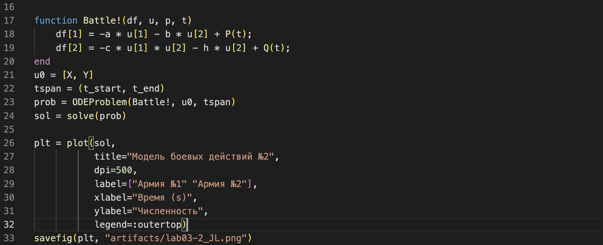

---
## Front matter
title: "Лабораторная работа №3"
subtitle: "Модель боевых действий"
author: Ибрагимов Улугбек Ботырхонович

## Generic otions
lang: ru-RU
toc-title: "Содержание"

## Bibliography
bibliography: bib/cite.bib
csl: pandoc/csl/gost-r-7-0-5-2008-numeric.csl

## Pdf output format
toc: true # Table of contents
toc-depth: 2
lof: true # List of figures
lot: false # List of tables
fontsize: 12pt
linestretch: 1.5
papersize: a4
documentclass: scrreprt
## I18n polyglossia
polyglossia-lang:
  name: russian
  options:
	- spelling=modern
	- babelshorthands=true
polyglossia-otherlangs:
  name: english
## I18n babel
babel-lang: russian
babel-otherlangs: english
## Fonts
mainfont: PT Serif
romanfont: PT Serif
sansfont: PT Sans
monofont: PT Mono
mainfontoptions: Ligatures=TeX
romanfontoptions: Ligatures=TeX
sansfontoptions: Ligatures=TeX,Scale=MatchLowercase
monofontoptions: Scale=MatchLowercase,Scale=0.9
## Biblatex
biblatex: true
biblio-style: "gost-numeric"
biblatexoptions:
  - parentracker=true
  - backend=biber
  - hyperref=auto
  - language=auto
  - autolang=other*
  - citestyle=gost-numeric
## Pandoc-crossref LaTeX customization
figureTitle: "Рис."
tableTitle: "Таблица"
listingTitle: "Листинг"
lofTitle: "Список иллюстраций"
lotTitle: "Список таблиц"
lolTitle: "Листинги"
## Misc options
indent: true
header-includes:
  - \usepackage{indentfirst}
  - \usepackage{float} # keep figures where there are in the text
  - \floatplacement{figure}{H} # keep figures where there are in the text
---

# Цель работы

Рассмотреть простейшие модели боевых действий, а именно модели Ланчестера. Смоделировать боевые действия средствами OpenModellica и Julia.

# Задачи

Между страной $X$ и страной $Y$ идет война. Численность состава войск исчисляется от начала войны, и являются временными функциями $x(t)$ и $y(t)$.

Необходимо построить:

1. Модель боевых действий между регулярными войсками;

$$
\left\{
\begin{array}{c}
\frac{dx}{dt} = -0.312x(t) - 0.456y(t) + \sin(t + 3)\\
 \\
\frac{dy}{dt} = -0.256x(t) - 0.340y(t) + \cos(t + 7)
\end{array}
\right.
$$

2. Модель ведение боевых действий с участием регулярных войск и партизанских отрядов.

$$
\left\{
\begin{array}{c}
\frac{dx}{dt} = -0.318x(t) - 0.615y(t) + |\cos(8t)|\\
 \\
\frac{dy}{dt} = -0.312x(t)y(t) - 0.512y(t) + |\sin(6t)|
\end{array}
\right.
$$

# Термины

-   Julia – это открытый свободный высокопроизводительный динамический язык высокого уровня, созданный специально для технических (математических) вычислений. Его синтаксис близок к синтаксису других сред технических вычислений, таких как Matlab и Octave. [@unn-julia]

-   OpenModelica — свободное открытое программное обеспечение для моделирования, симуляции, оптимизации и анализа сложных динамических систем. Основано на языке Modelica. [@wiki-om]

# Теоретическое введение

Рассмотрим некоторые простейшие модели боевых действий – модели Ланчестера. В противоборстве могут принимать участие как регулярные войска, так и партизанские отряды. В общем случае главной характеристикой соперников являются численности сторон. Если в какой-то момент времени одна из численностей обращается в нуль, то данная сторона считается проигравшей (приусловии, что численность другой стороны в данный момент положительна). [@rudn-task]

Рассмотри два случая ведения боевых действий:

1. Боевые действия между регулярными войсками;
2. Боевые действия с участием регулярных войск и партизанских отрядов;

В первом случае численность регулярных войск определяется тремя факторами:

-   скорость уменьшения численности войск из-за причин, не связанных с боевыми действиями (болезни, травмы, дезертирство);
-   скорость потерь, обусловленных боевыми действиями
    противоборствующих сторон (что связанно с качеством стратегии, уровнем вооружения, профессионализмом солдат и т.п.);
-   скорость поступления подкрепления (задаётся некоторой функцией от времени).

В этом случае модель боевых действий между регулярными войсками описывается следующим образом

$$
\left\{
\begin{array}{c}
\frac{dx}{dt} = -a(t)x(t) - b(t)y(t) + P(t)\\
 \\
\frac{dy}{dt} = -c(t)x(t) - h(t)y(t) + Q(t)
\end{array}
\right.
,\ где
$$

$-a(t)x(t)$ и $-h(t)y(t)$ - потери, не связанные с боевыми действиями,

$-b(t)y(t)$ и $-c(t)x(t)$ - отражают потери на поле боя,

$b(t)$ и $c(t)$ - эффективность боевых действий со стороны у и х соответственно,

$a(t)$ и $h(t)$ - величины, характеризующие степень влияния различных факторов на потери,

$P(t)$ и $Q(t)$ - функции, которые учитывают возможность подхода подкрепления к войскам Х и У в течение одного дня.

Во втором случае в борьбу добавляются партизанские отряды. Нерегулярные войска в отличии от постоянной армии менее уязвимы, так как действуют скрытно, в этом случае сопернику приходится действовать неизбирательно, по площадям, занимаемым партизанами. Поэтому считается, что тем потерь партизан, проводящих свои операции в разных местах на некоторой известной территории, пропорционален не только численности армейских соединений, но и численности самих партизан. В результате модель принимает вид:

$$
\left\{
\begin{array}{c}
\frac{dx}{dt} = -a(t)x(t) - b(t)y(t) + P(t)\\
 \\
\frac{dy}{dt} = -c(t)x(t)y(t) - h(t)y(t) + Q(t)
\end{array},\ где
\right.
$$

# Выполнение лабораторной работы

1. Установим пакет в Julia необходимый для построения графиков (Plots) и работы с дифференциальными уравнениями (DifferentialEquations). (рис. @fig:001)

{#fig:001 width=86%}

2. Напишем скрипт для моделирования боевых действий между регулярными войсками. Первым делом подкючим пакеты "Plots" [@docs-plots] и "DifferentialEquations" [@docs-de], далее объявим начальные данные при помощи констант. После чего используя DifferentialEquations составим и решим систему однородных дифференциальных уравнений. В конце используем Plots для того чтобы построить модель. (рис. @fig:002, @fig:003)

```Julia
# подключение пакетов
using Plots
using DifferentialEquations

# начальные данные
const X = 44200
const Y = 54200
const a = 0.312
const b = 0.456
const c = 0.256
const h = 0.340
const P(t) = sin.(t + 3)
const Q(t) = cos.(t + 7)
const t_start = 0
const t_end = 2.16

# используем DifferentialEquations,
# чтобы описать и решить систему ОДУ
function Battle!(df, u, p, t)
    df[1] = -a * u[1] - b * u[2] + P(t);
    df[2] = -c * u[1] - h * u[2] + Q(t);
end
u0 = [X, Y]
tspan = (t_start, t_end)
prob = ODEProblem(Battle!, u0, tspan)
sol = solve(prob)

# используем Plots,
# чтобы построить график решения
plt = plot(sol,
          title="Модель боевых действий №1",
          dpi=500,
          label=["Армия №1" "Армия №2"],
          xlabel="Время (s)",
          ylabel="Численность")
savefig(plt, "artifacts/lab03-1_JL.png")
```

{#fig:002 width=86%}

{#fig:003 width=86%}

3. Запускаем написанный скрипт и получаем модель боевых действий между регулярными войсками. (рис. @fig:004)

{#fig:004 width=86%}

4. Изменяем написанный скрипт, чтобы построить скрипт для моделирования боевых действий с участием регулярных войск и партизанских отрядов. Для этого нам понадобиться изменить начальные данные и функцию, описывающую систему ОДУ. (рис. @fig:005, @fig:006)

```Julia
# подключение пакетов
using Plots
using DifferentialEquations

# начальные данные
const X = 44200
const Y = 54200
const a = 0.318
const b = 0.615
const c = 0.312
const h = 0.512
const P(t) = abs.(cos.(8 * t))
const Q(t) = abs.(sin.(6 * t))
const t_start = 0
const t_end = 0.001

# используем DifferentialEquations,
# чтобы описать и решить систему ОДУ
function Battle!(df, u, p, t)
    df[1] = -a * u[1] - b * u[2] + P(t);
    df[2] = -c * u[1] * u[2] - h * u[2] + Q(t);
end
u0 = [X, Y]
tspan = (t_start, t_end)
prob = ODEProblem(Battle!, u0, tspan)
sol = solve(prob)

# используем Plots,
# чтобы построить график решения
plt = plot(sol,
           title="Модель боевых действий №2",
           dpi=500,
           label=["Армия №1" "Армия №2"],
           xlabel="Время (s)",
           ylabel="Численность",
           legend=:outertop)
savefig(plt, "artifacts/lab03-2_JL.png")
```

{#fig:005 width=86%}

{#fig:006 width=86%}

5. Запускаем написанный скрипт и получаем модель боевых действий с участием регулярных войск и партизанских отрядов. (рис. @fig:007)

{#fig:007 width=86%}

6. Перейдем к построению модели боевых действий между регулярными войсками при помощи OpenModelica. Для этого нам необходимо создать модель, внутри которой сначала объявим необходимые переменные, после чего проинициализирем начальные условия и в конце введем непосредственно уравнения для моделирования. (рис. @fig:008)

```Modelica
model Battle01
    Real x;
    Real y;
    Real a = 0.312;
    Real b = 0.456;
    Real c = 0.256;
    Real h = 0.340;
    Real t = time;
initial equation
    x = 44200;
    y = 54200;
equation
    der(x) = -a * x - b * y  + sin(t + 3);
    der(y) = -c * x - h * y  + cos(t + 7);
end Battle01;
```

{#fig:008 width=86%}

7. Запустим симмуляцию, напишем легенду для получившейся модели и экспортируем итог. (рис. @fig:009, @fig:010, @fig:011)

{#fig:009 width=86%}

{#fig:010 width=86%}

{#fig:011 width=86%}

8. Приступим к моделированию боевых действий с участием регулярных войск и партизанских отрядов на OpenModelica. Для этого перепишем начальные данные и изменим уравнение, взяв за основу предыдущий скрипт. (рис. @fig:012)

```Modelica
model Battle02
    Real x;
    Real y;
    Real a = 0.318;
    Real b = 0.615;
    Real c = 0.312;
    Real h = 0.512;
    Real t = time;
initial equation
    x = 44200;
    y = 54200;
equation
    der(x) = -a * x - b * y  + abs(cos(8 * t));
    der(y) = -c * x * y - h * y  + abs(sin(6 * t));
end Battle02;
```

{#fig:012 width=86%}

9. Запустим симмуляцию, пропишем легенду и экспортируем график. (рис. @fig:013)

{#fig:013 width=86%}

# Анализ результатов

Работа выполненна без непредвиденных проблем в соответствии с руководством. Ошибок и сбоев не произошло. Моделирование на OMEdit было проще и быстрее, чем при использовании средств Julia. Скрипт на Modelica вышел более лакончиным, понятным и коротким. Более того OpenModelica быстрее обрабатывала скрипт и симмулировала модель. Стоит отметить, что OpenModelica имеет множество разлиных полезных инструментов для настройки с симмуляцией и работой с ней. К плюсам Julia можно отнести, что она является языком программирования, который хорошо подходит для математических и технических задач.

# Выводы

Мы улучшили практические навыки в области дифференциальных уравнений, улучшили навыки моделирования на Julia, также приобрели навыки моделирования на OpenModelica. Изучили простейшие модели боевых действий.

# Список литературы{.unnumbered}

::: {#refs}
:::
