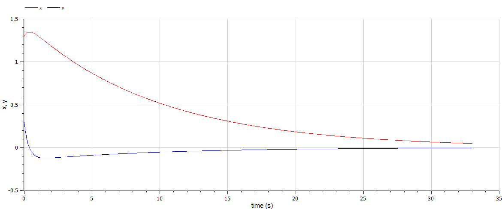
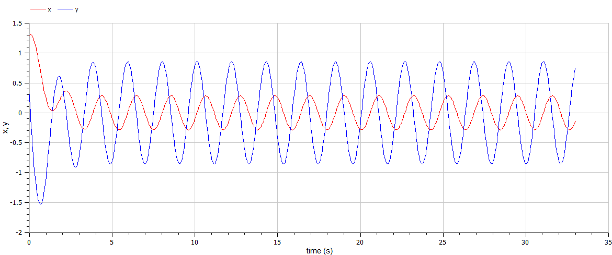

---
## Front matter
title: "Лабораторная работа №4"
subtitle: "Модель гармонических колебаний"
author: "Ильин Андрей Владимирович"

## Generic otions
lang: ru-RU
toc-title: "Содержание"

## Bibliography
bibliography: bib/cite.bib
csl: pandoc/csl/gost-r-7-0-5-2008-numeric.csl

## Pdf output format
toc: true # Table of contents
toc-depth: 2
lof: true # List of figures
lot: false # List of tables
fontsize: 12pt
linestretch: 1.5
papersize: a4
documentclass: scrreprt
## I18n polyglossia
polyglossia-lang:
  name: russian
  options:
	- spelling=modern
	- babelshorthands=true
polyglossia-otherlangs:
  name: english
## I18n babel
babel-lang: russian
babel-otherlangs: english
## Fonts
mainfont: PT Serif
romanfont: PT Serif
sansfont: PT Sans
monofont: PT Mono
mainfontoptions: Ligatures=TeX
romanfontoptions: Ligatures=TeX
sansfontoptions: Ligatures=TeX,Scale=MatchLowercase
monofontoptions: Scale=MatchLowercase,Scale=0.9
## Biblatex
biblatex: true
biblio-style: "gost-numeric"
biblatexoptions:
  - parentracker=true
  - backend=biber
  - hyperref=auto
  - language=auto
  - autolang=other*
  - citestyle=gost-numeric
## Pandoc-crossref LaTeX customization
figureTitle: "Рис."
tableTitle: "Таблица"
listingTitle: "Листинг"
lofTitle: "Список иллюстраций"
lotTitle: "Список таблиц"
lolTitle: "Листинги"
## Misc options
indent: true
header-includes:
  - \usepackage{indentfirst}
  - \usepackage{float} # keep figures where there are in the text
  - \floatplacement{figure}{H} # keep figures where there are in the text
---

# Цель работы

Рассмотреть уравнение гармонических колебаний. Построить модель гармонических колебаний средствами OpenModellica и Julia.

# Задачи

Построить фазовый портрет гармонического осциллятора и решение уравнения гармонического осциллятора для следующих случаев

1. Колебания гармонического осциллятора без затуханий и без действий внешней силы $\dot x + 3.3x = 0$.

2. Колебания гармонического осциллятора c затуханием и без действий внешней силы $\ddot x + 3\dot x + 0.3x = 0$.

3. Колебания гармонического осциллятора c затуханием и под действием внешней силы $\ddot x + 3.3\dot x + 0.3x = 3.3\sin(3t)$.

На интервале $t \in [0; 33]$ (шаг $0.05$) с начальными условиями $x_0 = 1.3, \ y_0 = 0.3$.

# Среда

-   Julia – это открытый свободный высокопроизводительный динамический язык высокого уровня, созданный специально для технических (математических) вычислений. Его синтаксис близок к синтаксису других сред технических вычислений, таких как Matlab и Octave. [@unn-julia]

-   OpenModelica — свободное открытое программное обеспечение для моделирования, симуляции, оптимизации и анализа сложных динамических систем. Основано на языке Modelica. [@wiki-om]

# Теоретическое введение

Движение грузика на пружинке, маятника, заряда в электрическом контуре, а также эволюция во времени многих систем в физике, химии, биологии и других науках при определенных предположениях можно описать одним и тем же дифференциальным уравнением, которое в теории колебаний выступает в качестве основной модели. [@rudn-task]

Эта модель называется линейным гармоническим осциллятором. Уравнение свободных колебаний гармонического осциллятора имеет следующий вид:

$$\ddot x + 2 \gamma \dot x + \omega_0^2 x = 0$$

где $x$ – переменная, описывающая состояние системы (смещение грузика, заряд конденсатора и т.д.), $\gamma$ – параметр, характеризующий потери энергии (трение в механической системе, сопротивление в контуре), $\omega_0$ – собственная частота колебаний, $t$ – время. (Обозначения $\ddot x = \frac{\partial^2x}{\partial^2t}$, $\dot x = \frac{\partial x}{\partial t}$)

При отсутствии потерь в системе вместо вышекуказанного уравнения получаем уравнение консервативного осциллятора энергия колебания которого сохраняется во времени

$$\ddot x + \omega_0^2x = 0$$

Для однозначной разрешимости уравнения второго порядка необходимо задать два начальных условия вида

$$
\left\{
\begin{array}{c}
x(t_0) = x_0
\\ \\
\dot x (t_0) = y_0
\end{array}
\right.
$$

Уравнение консервативного осциллятора энергия колебания которого сохраняется во времени можно представить в виде системы двух уравнений первого порядка:

$$
\left\{
\begin{array}{c}
\dot x = y
\\ \\
\dot y = - \omega_0^2x
\end{array}
\right.
$$

Начальные условия для системы примут вид:

$$
\left\{
\begin{array}{c}
x(t_0) = x_0
\\ \\
y (t_0) = y_0
\end{array}
\right.
$$

Независимые переменные $x$, $y$ определяют пространство, в котором «движется» решение. Это фазовое пространство системы, поскольку оно двумерно будем называть его фазовой плоскостью.

Значение фазовых координат $x$, $y$ в любой момент времени полностью определяет состояние системы. Решению уравнения движения как функции времени отвечает гладкая кривая в фазовой плоскости. Она называется фазовой траекторией. Если множество различных решений (соответствующих различным начальным условиям) изобразить на одной фазовой плоскости, возникает общая картина поведения системы. Такую картину, образованную набором фазовых траекторий, называют фазовым портретом.

# Выполнение лабораторной работы

1. Начнем выполнения поставленных задач в Julia. Для этого запустим Pluto [@pluto-jl]. (рис. @fig:001)

{#fig:001 width=86%}

2. Первым делом подкючим пакеты "Plots" [@docs-plots] и "DifferentialEquations" [@docs-de]. Далее объявим начальные данные при помощи констант. Также объявим начальное условие для системы ДУ и промежуток времени, на котором будет проходить моделирование. (рис. @fig:002)

```Julia
# подключение пакетов
using Plots
using DifferentialEquations

# входные данные
const startT = 0
const endT = 33
const stepT = 0.05
const x0 = 1.3
const y0 = 0.3

# начальные условия
u0 = [x0, y0]
# промежуток времени
spanT = (startT, endT)
```

{#fig:002 width=86%}

3. В следующей ячейке Pluto построим фазовый портрет и решение уравнения гармонического осциллятора. Для этого оъявим параметры осциллятора, а кокретно частоту. Также по аналогии с прошлой лабораторной работой при помощи 'DifferentialEquations' зададим и решим систему ДУ, после чего построим график ее решения. Так же создадим два списка, в которых будут храниться точки уравнений. Воспользуемся данным списком, чтобы построить фазовый портрет. (рис. @fig:003, @fig:004, @fig:005)

```Julia
w = 3.3

# используем DifferentialEquations,
# чтобы описать и решить систему ОДУ
function Fluctuations!(df, u, p, t)
  df[1] = u[2]
  df[2] = -w * u[1]
end

prob = ODEProblem(Fluctuations!, u0, spanT)
sol = solve(prob, dtmax=stepT)

X = [u[1] for u in sol.u]
Y = [u[2] for u in sol.u]

# используем Plots,
# чтобы построить график решения уравнения
plt01 = plot(sol,
      dpi=500,
      xlabel="Время (s)",
      ylabel="x, y",
      legend=false)
savefig(plt01, "artifacts/JL.lab04-010.png")

# используем Plots,
# чтобы построить фазовый портрет
plt02 = plot(X, Y,
      dpi=500,
      xlabel="x",
      ylabel="y",
      legend=false)
savefig(plt02, "artifacts/JL.lab04-011.png")

println("Success!")
```

{#fig:003 width=86%}

{#fig:004 width=86%}

{#fig:005 width=86%}

4. Доработаем данный скрипт, чтобы построить решение уравнения и фазовый портрет гармонического осциллятора c затуханием и без действий внешней силы. Для этого нам неободимо добавить новый параметр - затухание. Также необходимо изменить функцию системы ДУ. (рис. @fig:006, @fig:007, @fig:008)

```Julia
w = 0.3 #!
g = 3 #!

function Fluctuations!(df, u, p, t)
  df[1] = u[2]
  df[2] = -w * u[1] - g * u[2] #!
end

prob = ODEProblem(Fluctuations!, u0, spanT)
sol = solve(prob, dtmax=stepT)

X = [u[1] for u in sol.u]
Y = [u[2] for u in sol.u]

plt01 = plot(sol,
      dpi=500,
      xlabel="Время (s)",
      ylabel="x, y",
      legend=false)
savefig(plt01, "artifacts/JL.lab04-020.png")

plt02 = plot(X, Y,
      dpi=500,
      xlabel="x",
      ylabel="y",
      legend=false)
savefig(plt02, "artifacts/JL.lab04-021.png")

println("Success!")
```

{#fig:006 width=86%}

{#fig:007 width=86%}

{#fig:008 width=86%}

5. Еще раз доработаем скрипт, чтобы построить решение уравнения и фазовый портрет гармонического осциллятора c затуханием и под действием внешней силы. Для этого нам неободимо добавить новый параметр - функция внешней силы. Также необходимо изменить функцию системы ДУ. (рис. @fig:009, @fig:010, @fig:011)

```Julia
w = 3 #!
g = 3.3 #!
f(t) = 3.3 * sin.(3 * t) #!

function Fluctuations!(df, u, p, t)
  df[1] = u[2]
  df[2] = -w * u[1] - g * u[2] - f(t) #!
end

prob = ODEProblem(Fluctuations!, u0, spanT)
sol = solve(prob, dtmax=stepT)

X = [u[1] for u in sol.u]
Y = [u[2] for u in sol.u]

plt01 = plot(sol,
      dpi=500,
      xlabel="Время (s)",
      ylabel="x, y",
      legend=false)
savefig(plt01, "artifacts/JL.lab04-030.png")

plt02 = plot(X, Y,
      dpi=500,
      xlabel="x",
      ylabel="y",
      legend=false)
savefig(plt02, "artifacts/JL.lab04-031.png")

println("Success!")
```

{#fig:009 width=86%}

{#fig:010 width=86%}

{#fig:011 width=86%}

6. Построим модель колебания гармонического осциллятора без затуханий и без действий внешней силы на Modelica. (рис. @fig:012, @fig:013, @fig:014)

```modelica
model lab04_01
    constant Real w = 3.3;
    Real x;
    Real y;
    Real t = time;
initial equation
    x = 1.3;
    y = 0.3;
equation
  der(x) = y;
  der(y) = -w * x;
  annotation(experiment(StartTime = 0, StopTime = 33, Interval = 0.05));
end lab04_01;
```

{#fig:012 width=86%}

{#fig:013 width=86%}

{#fig:014 width=86%}

7. Построим модель колебания гармонического осциллятора с затуханием и без действий внешней силы на Modelica. (рис. @fig:015, @fig:016, @fig:017)

```modelica
model lab04_02
    constant Real w = 0.3;
    constant Real g = 3;
    Real x;
    Real y;
    Real t = time;
initial equation
    x = 1.3;
    y = 0.3;
equation
  der(x) = y;
  der(y) = -w * x - g * y;
  annotation(experiment(StartTime = 0, StopTime = 33, Interval = 0.05));
end lab04_02;

```

{#fig:015 width=86%}

{#fig:016 width=86%}

{#fig:017 width=86%}

8. Построим модель колебания гармонического осциллятора с затуханием и под действием внешней силы на Modelica. (рис. @fig:018, @fig:019, @fig:020)

```modelica
model lab04_02
    constant Real w = 0.3;
    constant Real g = 3;
    Real x;
    Real y;
    Real t = time;
initial equation
    x = 1.3;
    y = 0.3;
equation
  der(x) = y;
  der(y) = -w * x - g * y;
  annotation(experiment(StartTime = 0, StopTime = 33, Interval = 0.05));
end lab04_02;

```

{#fig:018 width=86%}

{#fig:019 width=86%}

{#fig:020 width=86%}

# Анализ результатов

Работа выполненна без непредвиденных проблем в соответствии с руководством. Ошибок и сбоев не произошло.

Моделирование на OMEdit было проще и быстрее, чем при использовании средств Julia. Скрипт на Modelica вышел более лакончиным, понятным и коротким. Более того OpenModelica быстрее обрабатывала скрипт и симмулировала модель. Стоит отметить, что OpenModelica имеет множество разлиных полезных инструментов для настройки с симмуляцией и работой с ней. К плюсам Julia можно отнести, что она является языком программирования, который хорошо подходит для математических и технических задач.

# Выводы

Мы улучшили практические навыки в области дифференциальных уравнений, улучшили навыки моделирования на Julia, также приобрели навыки моделирования на OpenModelica. Изучили модель rолебания гармонического осциллятора. Научились строить фазовые портреты.

# Список литературы{.unnumbered}

::: {#refs}
:::
