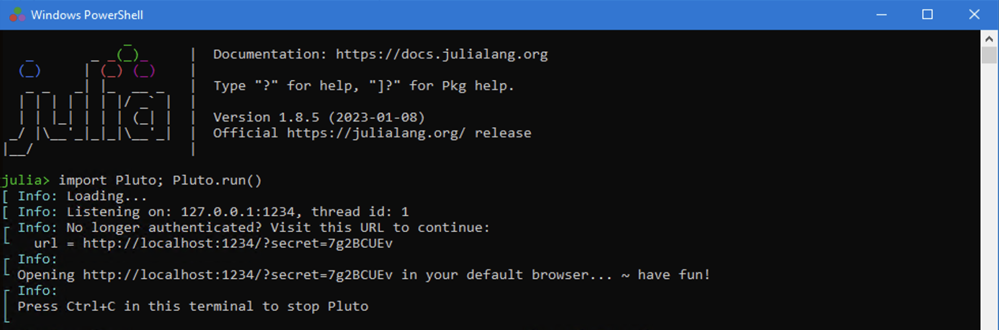

---
## Front matter
lang: ru-RU
title: Лабораторная работа №5
subtitle: Модель хищник-жертва
author: Ибрагимов Улугбек Ботырхонович
institute: Российский университет дружбы народов, Москва, Россия

## i18n babel
babel-lang: russian
babel-otherlangs: english

## Fonts
mainfont: PT Serif
romanfont: PT Serif
sansfont: PT Sans
monofont: PT Mono
mainfontoptions: Ligatures=TeX
romanfontoptions: Ligatures=TeX
sansfontoptions: Ligatures=TeX,Scale=MatchLowercase
monofontoptions: Scale=MatchLowercase,Scale=0.9

## Formatting pdf
toc: false
toc-title: Содержание
slide_level: 2
aspectratio: 169
section-titles: true
theme: metropolis
header-includes:
    - \metroset{progressbar=frametitle,sectionpage=progressbar,numbering=fraction}
    - '\makeatletter'
    - '\beamer@ignorenonframefalse'
    - '\makeatother'
---

# Информация

## Докладчик

:::::::::::::: {.columns align=center}
::: {.column width="70%"}

-   Ибрагимов Улугбек Ботырхонович
-   НФИбд-02-20
-   1032204510
-   Российский Университет Дружбы Народов
-   [1032204510@pfur.ru](mailto:1032204510@pfur.ru)
-   <https://github.com/gkwd>

:::
::: {.column width="30%"}

:::
::::::::::::::

# Вводная часть

## Актуальность

-   Приобрести необхдимые в современном научном сообществе навыки моделирования задач.
-   Освоить средства моделирования, такие как Julia и OpenModelica

## Объект и предмет исследования

-   Язык программирования Julia
-   OpenModelica
-   Модель хищник-жертва

## Цель

-   Рассмотреть модель хищник-жертва.
-   Построить модель хищник-жертва средствами OpenModellica и Julia.

## Задачи

Для модели «хищник-жертва»:

$$
\begin{cases}
\frac{dx}{dt} = -0.81x(t) + 0.048x(t)y(t) \\
\frac{dy}{dt} = 0.76y(t) - 0.038x(t)y(t) \\
\end{cases}
$$

1. Построить график зависимости численности хищников от численности жертв, а также графики изменения численности хищников и численности жертв при следующих начальных условиях: $x_0 = 7$, $y_0 = 29$.

2. Найти стационарное состояние системы.

## Материалы и методы

-   Язык программирования Julia
-   OpenModelica

# Выполнение работы

## Julia. Pluto.

## Julia. Cкрипт (1)

## Julia. Cкрипт (2)

## Julia. Модель (1)

:::::::::::::: {.columns align=center}
::: {.column width="50%"}

:::
::: {.column width="50%"}

:::
::::::::::::::

## Julia. Модель (2)

:::::::::::::: {.columns align=center}
::: {.column width="50%"}

:::
::: {.column width="50%"}

:::
::::::::::::::

## Modellica. Cкрипт

## Modellica. Модель (1)

:::::::::::::: {.columns align=center}
::: {.column width="50%"}

:::
::: {.column width="50%"}

{#fig:011 width=86%}

:::
::::::::::::::

## Modellica. Модель (2)

:::::::::::::: {.columns align=center}
::: {.column width="50%"}

:::
::: {.column width="50%"}

:::
::::::::::::::

# Результаты

## Итог

Мы улучшили практические навыки в области дифференциальных уравнений, улучшили навыки моделирования на Julia, также ekexibkb навыки моделирования на OpenModelica. Изучили модель взаимодействия двух видов типа «хищник — жертва», а именно модель Лотки-Вольтерры.

## {.standout}

Спасибо за внимание!
