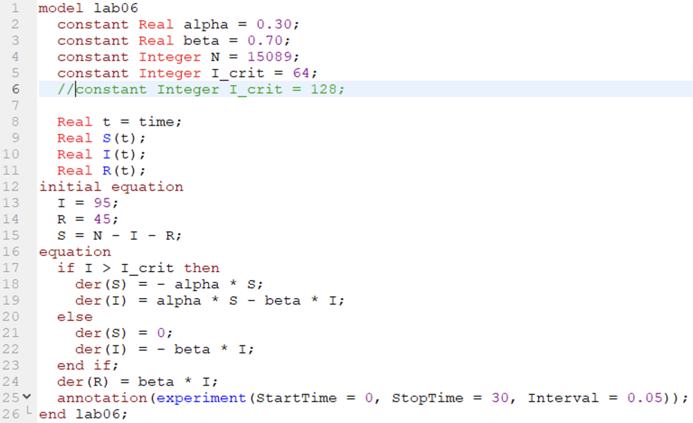

---
## Front matter
lang: ru-RU
title: Лабораторная работа №6
subtitle: Задача об эпидемии
author:  Ибрагимов Улугбек Ботырхонович
institute: Российский университет дружбы народов, Москва, Россия

## i18n babel
babel-lang: russian
babel-otherlangs: english

## Fonts
mainfont: PT Serif
romanfont: PT Serif
sansfont: PT Sans
monofont: PT Mono
mainfontoptions: Ligatures=TeX
romanfontoptions: Ligatures=TeX
sansfontoptions: Ligatures=TeX,Scale=MatchLowercase
monofontoptions: Scale=MatchLowercase,Scale=0.9

## Formatting pdf
toc: false
toc-title: Содержание
slide_level: 2
aspectratio: 169
section-titles: true
theme: metropolis
header-includes:
    - \metroset{progressbar=frametitle,sectionpage=progressbar,numbering=fraction}
    - '\makeatletter'
    - '\beamer@ignorenonframefalse'
    - '\makeatother'
---

# Информация

## Докладчик

:::::::::::::: {.columns align=center}
::: {.column width="70%"}

-   Ибрагимов Улугбек Ботырхонович
-   НФИбд-02-20
-   1032204510
-   Российский Университет Дружбы Народов
-   [1032201656@pfur.ru](mailto:1032204510@pfur.ru)
-   <https://github.com/gkwd>

:::
::: {.column width="30%"}

:::
::::::::::::::

# Вводная часть

## Актуальность

-   Приобрести необхдимые в современном научном сообществе навыки моделирования задач.
-   Освоить средства моделирования, такие как Julia и OpenModelica

## Объект и предмет исследования

-   Язык программирования Julia
-   OpenModelica
-   Модель эпидемии (изменная модель SIR).

## Цель

-   Рассмотреть модель эпидемии.
-   построить данную модель средствами OpenModellica и Julia.

## Задачи

На одном острове вспыхнула эпидемия. Известно, что из всех проживающих на острове ($N=15089$) в момент начала эпидемии ($t=0$) число заболевших людей (являющихся распространителями инфекции) $I(0)=95$, А число здоровых людей с иммунитетом к болезни $R(0)=45$. Таким образом, число людей восприимчивых к болезни, но пока здоровых, в начальный момент времени $S(0)=N-I(0)- R(0)$.

Построить графики изменения числа особей в каждой из трех групп. Рассмотреть, как будет протекать эпидемия в случае:

1. если $I(0) \leq I^*$
2. если $I(0) > I^*$

## Материалы и методы

-   Julia, Pluto
-   Modelica, OMEdit

# Выполнение работы

## Julia. Pluto.

## Julia. Cкрипт (1)

## Julia. Cкрипт (2)

## Julia. Модель (1)

:::::::::::::: {.columns align=center}
::: {.column width="50%"}

:::
::: {.column width="50%"}

:::
::::::::::::::

## Modellica. Cкрипт

## Modellica. Модель (1)

:::::::::::::: {.columns align=center}
::: {.column width="50%"}

:::
::: {.column width="50%"}

:::
::::::::::::::

# Результаты

## Итог

Мы улучшили практические навыки в области дифференциальных уравнений, улучшили навыки моделирования на Julia, а также навыки моделирования на OpenModelica. Изучили видоизмененную модель заражения SIR и решили при ее помощи задачу об эпидемии.

## {.standout}

Спасибо за внимание!
