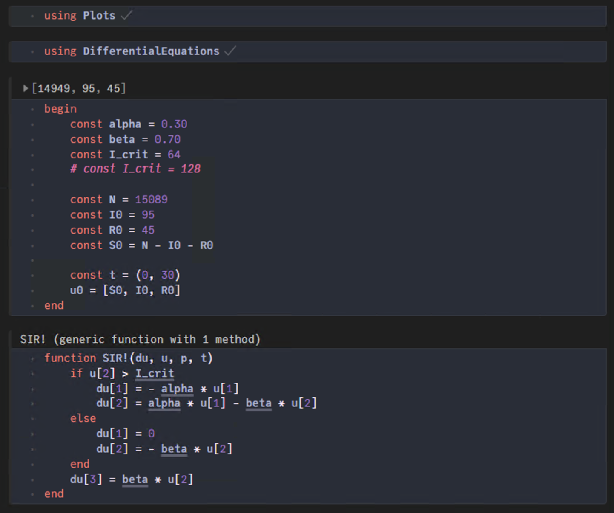

---
## Front matter
title: "Лабораторная работа №6"
subtitle: "Задача об эпидемии"
author:  Ибрагимов Улугбек Ботырхонович

## Generic otions
lang: ru-RU
toc-title: "Содержание"

## Bibliography
bibliography: bib/cite.bib
csl: pandoc/csl/gost-r-7-0-5-2008-numeric.csl

## Pdf output format
toc: true # Table of contents
toc-depth: 2
lof: true # List of figures
lot: false # List of tables
fontsize: 12pt
linestretch: 1.5
papersize: a4
documentclass: scrreprt
## I18n polyglossia
polyglossia-lang:
  name: russian
  options:
	- spelling=modern
	- babelshorthands=true
polyglossia-otherlangs:
  name: english
## I18n babel
babel-lang: russian
babel-otherlangs: english
## Fonts
mainfont: PT Serif
romanfont: PT Serif
sansfont: PT Sans
monofont: PT Mono
mainfontoptions: Ligatures=TeX
romanfontoptions: Ligatures=TeX
sansfontoptions: Ligatures=TeX,Scale=MatchLowercase
monofontoptions: Scale=MatchLowercase,Scale=0.9
## Biblatex
biblatex: true
biblio-style: "gost-numeric"
biblatexoptions:
  - parentracker=true
  - backend=biber
  - hyperref=auto
  - language=auto
  - autolang=other*
  - citestyle=gost-numeric
## Pandoc-crossref LaTeX customization
figureTitle: "Рис."
tableTitle: "Таблица"
listingTitle: "Листинг"
lofTitle: "Список иллюстраций"
lotTitle: "Список таблиц"
lolTitle: "Листинги"
## Misc options
indent: true
header-includes:
  - \usepackage{indentfirst}
  - \usepackage{float} # keep figures where there are in the text
  - \floatplacement{figure}{H} # keep figures where there are in the text
---

# Цель работы

Рассмотреть модель эпидемии. Построить вышеуказанную модель средствами OpenModellica и Julia.

# Задачи

На одном острове вспыхнула эпидемия. Известно, что из всех проживающих на острове ($N=15089$) в момент начала эпидемии ($t=0$) число заболевших людей (являющихся распространителями инфекции) $I(0)=95$, А число здоровых людей с иммунитетом к болезни $R(0)=45$. Таким образом, число людей восприимчивых к болезни, но пока здоровых, в начальный момент времени $S(0)=N-I(0)- R(0)$.

Построить графики изменения числа особей в каждой из трех групп. Рассмотреть, как будет протекать эпидемия в случае:

1. если $I(0) \leq I^*$
2. если $I(0) > I^*$

# Среда

-   Julia – это открытый свободный высокопроизводительный динамический язык высокого уровня, созданный специально для технических (математических) вычислений. Его синтаксис близок к синтаксису других сред технических вычислений, таких как Matlab и Octave. [@unn-julia]

-   OpenModelica — свободное открытое программное обеспечение для моделирования, симуляции, оптимизации и анализа сложных динамических систем. Основано на языке Modelica. [@wiki-om]

# Теоретическое введение

Предположим, что некая популяция, состоящая из $N$ особей, (считаем, что популяция изолирована) подразделяется на три группы. Первая группа - это восприимчивые к болезни, но пока здоровые особи, обозначим их через $S(t)$. Вторая группа – это число инфицированных особей, которые также при этом являются распространителями инфекции, обозначим их $I(t)$. А третья группа, обозначающаяся через $R(t)$ – это здоровые особи с иммунитетом к болезни. [@rudn-task]

До того, как число заболевших не превышает критического значения $I^*$, считаем, что все больные изолированы и не заражают здоровых. Когда $I(t) > I^*$, тогда инфицирование способны заражать восприимчивых к болезни особей.

Таким образом, скорость изменения числа $S(t)$ меняется по следующему закону:

$$
\frac{dS}{dt} =
\begin{cases}
-\alpha S,\ если\ I(t) > I^* \\
0,\ если\ I(t) \leq I^* \\
\end{cases}
$$

Поскольку каждая восприимчивая к болезни особь, которая, в конце концов, заболевает, сама становится инфекционной, то скорость изменения числа инфекционных особей представляет разность за единицу времени между заразившимися и теми, кто уже болеет и лечится, т.е.:

$$
\frac{dI}{dt} =
\begin{cases}
\alpha S - \beta I,\ если\ I(t) > I^* \\
- \beta I,\ если\ I(t) \leq I^* \\
\end{cases}
$$

А скорость изменения выздоравливающих особей (при этом приобретающие иммунитет к болезни)

$$
\frac{dR}{dt} = \beta I
$$

Постоянные пропорциональности $\alpha$, $\beta$ - это коэффициенты заболеваемости и выздоровления соответственно.

# Выполнение лабораторной работы

1. Начнем выполнения поставленных задач в Julia. Для этого запустим Pluto [@pluto-jl]. (рис. @fig:001)

{#fig:001 width=86%}

2. Первым делом подкючим пакеты "Plots" [@docs-plots] и "DifferentialEquations" [@docs-de]. Далее объявим начальные данные при помощи констант. Также объявим начальное условие для системы ДУ и промежуток времени, на котором будет проходить моделирование. После этого объявим функцию, представляющую систему. (рис. @fig:002)

```Julia
# подключение пакетов
using Plots
using DifferentialEquations

# входные данные
const alpha = 0.30
const beta = 0.70
const I_crit = 64
const N = 15089
const I0 = 95
const R0 = 45
const S0 = N - I0 - R0

const t = (0, 30) # промежуток времени
u0 = [S0, I0, R0] # начальные условие ДУ

function SIR!(du, u, p, t)
	if u[2] > I_crit
		du[1] = - alpha * u[1]
		du[2] = alpha * u[1] - beta * u[2]
	else
		du[1] = 0
		du[2] = - beta * u[2]
	end
	du[3] = beta * u[2]
end
```

{#fig:002 width=86%}

3. В следующей ячейке Pluto построим модель. При помощи 'DifferentialEquations' зададим и решим систему ДУ, после чего построим график решения и сохраним его. Далее запустим итоговый скрипт. (рис. @fig:003, @fig:004)

```Julia
prob = ODEProblem(SIR!, u0, t)
sol = solve(prob)

plt = plot(
  sol,
  dpi=500,
  size=(1024, 512),
  plot_title="Задача об эпидемии",
  xlabel="Время",
  ylabel="S(t), I(t), R(t)",
  label=["S(t)" "I(t)" "R(t)"])

savefig(plt, "artifacts/JL.lab06-01.png")
println("Success")
```

{#fig:003 width=86%}

{#fig:004 width=86%}

4. Изменим значения $I^*$, так чтобы начальное число заболевших не превышало критическое значение. (рис. @fig:005, @fig:006)

```Julia
const alpha = 0.30
const beta = 0.70
# const I_crit = 64
const I_crit = 128

const N = 15089
const I0 = 95
const R0 = 45
const S0 = N - I0 - R0

const t = (0, 30)
u0 = [S0, I0, R0]
```

{#fig:005 width=86%}

{#fig:006 width=86%}

6. Постройте графики изменения числа особей в каждой из трех групп на Modelica. Для начала рассмотрим случай, когда $I(0) > I^*$. (рис. @fig:007, @fig:008)

```modelica
model lab06
  constant Real alpha = 0.30;
  constant Real beta = 0.70;
  constant Integer N = 15089;
  constant Integer I_crit = 64;
  Real t = time;
  Real S(t);
  Real I(t);
  Real R(t);
initial equation
  I = 95;
  R = 45;
  S = N - I - R;
equation
  if I > I_crit then
    der(S) = - alpha * S;
    der(I) = alpha * S - beta * I;
  else
    der(S) = 0;
    der(I) = - beta * I;
  end if;
  der(R) = beta * I;
  annotation(experiment(StartTime = 0, StopTime = 30, Interval = 0.05));
end lab06;
```

{#fig:007 width=86%}

{#fig:008 width=86%}

7. Теперь рассмотрим случай, когда $I(0) \leq I^*$. Для этого изменим значение I критического. (рис. @fig:009, @fig:010)

```modelica
model lab06
  constant Real alpha = 0.30;
  constant Real beta = 0.70;
  constant Integer N = 15089;
  constant Integer I_crit = 128;
  Real t = time;
  Real S(t);
  Real I(t);
  Real R(t);
initial equation
  I = 95;
  R = 45;
  S = N - I - R;
equation
  if I > I_crit then
    der(S) = - alpha * S;
    der(I) = alpha * S - beta * I;
  else
    der(S) = 0;
    der(I) = - beta * I;
  end if;
  der(R) = beta * I;
  annotation(experiment(StartTime = 0, StopTime = 30, Interval = 0.05));
end lab06;

```

{#fig:009 width=86%}

{#fig:010 width=86%}

# Анализ результатов

Работа выполненна без непредвиденных проблем в соответствии с руководством. Ошибок и сбоев не произошло.

Моделирование на OMEdit было проще и быстрее, чем при использовании средств Julia. Скрипт на Modelica вышел более лакончиным, понятным и коротким. Более того OpenModelica быстрее обрабатывала скрипт и симмулировала модель. Стоит отметить, что OpenModelica имеет множество разлиных полезных инструментов для настройки с симмуляцией и работой с ней.

К плюсам Julia можно отнести, что она является языком программирования, который хорошо подходит для математических и технических задач. Отметим, что скрипт на Julia выполняется долго из-за подключения пакетов, каждый раз при его запуске. При использовании Pluto, нет необходимости каждый раз с нуля выполнять скрипт, таким образом скорость выполнения может даже превышать скорость моделирования в OMEdit.

# Выводы

Мы улучшили практические навыки в области дифференциальных уравнений, улучшили навыки моделирования на Julia, а также навыки моделирования на OpenModelica. Изучили видоизмененную модель заражения SIR и решили при ее помощи задачу об эпидемии.

# Список литературы{.unnumbered}

::: {#refs}
:::
