---
## Front matter
title: "Лабораторная работа №7"
subtitle: "Эффективность рекламы"
author:  Ибрагимов Улугбек Ботырхонович

## Generic otions
lang: ru-RU
toc-title: "Содержание"

## Bibliography
bibliography: bib/cite.bib
csl: pandoc/csl/gost-r-7-0-5-2008-numeric.csl

## Pdf output format
toc: true # Table of contents
toc-depth: 2
lof: true # List of figures
lot: false # List of tables
fontsize: 12pt
linestretch: 1.5
papersize: a4
documentclass: scrreprt
## I18n polyglossia
polyglossia-lang:
  name: russian
  options:
	- spelling=modern
	- babelshorthands=true
polyglossia-otherlangs:
  name: english
## I18n babel
babel-lang: russian
babel-otherlangs: english
## Fonts
mainfont: PT Serif
romanfont: PT Serif
sansfont: PT Sans
monofont: PT Mono
mainfontoptions: Ligatures=TeX
romanfontoptions: Ligatures=TeX
sansfontoptions: Ligatures=TeX,Scale=MatchLowercase
monofontoptions: Scale=MatchLowercase,Scale=0.9
## Biblatex
biblatex: true
biblio-style: "gost-numeric"
biblatexoptions:
  - parentracker=true
  - backend=biber
  - hyperref=auto
  - language=auto
  - autolang=other*
  - citestyle=gost-numeric
## Pandoc-crossref LaTeX customization
figureTitle: "Рис."
tableTitle: "Таблица"
listingTitle: "Листинг"
lofTitle: "Список иллюстраций"
lotTitle: "Список таблиц"
lolTitle: "Листинги"
## Misc options
indent: true
header-includes:
  - \usepackage{indentfirst}
  - \usepackage{float} # keep figures where there are in the text
  - \floatplacement{figure}{H} # keep figures where there are in the text
---

# Цель работы

Рассмотреть модель распространениинформации о товаре (модель распространения рекламы). Построить вышеуказанную модель средствами OpenModellica и Julia.

# Задачи

Построить график распространения рекламы, математическая модель которой описывается следующим уравнением

1. $\frac{dn}{dt} = (0.133 + 0.000033n(t))(N - n(t))$
2. $\frac{dn}{dt} = (0.0000132 + 0.32n(t))(N - n(t))$
3. $\frac{dn}{dt} = (0.8t + 0.15\sin(t)n(t))(N - n(t))$

При этом объем аудитории $N = 1670$, в начальный момент о товаре знает 12 человек. Для случая 2 определить в какой момент времени скорость распространения рекламы будет иметь максимальное значение.

# Среда

-   Julia – это открытый свободный высокопроизводительный динамический язык высокого уровня, созданный специально для технических (математических) вычислений. Его синтаксис близок к синтаксису других сред технических вычислений, таких как Matlab и Octave. [@unn-julia]

-   OpenModelica — свободное открытое программное обеспечение для моделирования, симуляции, оптимизации и анализа сложных динамических систем. Основано на языке Modelica. [@wiki-om]

# Теоретическое введение

Предположим, что реализуется некоторая продукция, о которой в момент времени t из числа потенциальных покупателей N знает лишь n покупателей. Для ускорения сбыта продукции запускается реклама через СМИ. После запуска рекламной кампании информация о продукции начнет распространяться путем общения друг с другом. Таким образом, после запуска рекламных объявлений скорость изменения числа знающих о продукции людей пропорциональна как числу знающих о товаре, так и числу покупателей о нем не знающих. [@rudn-task]

Модель рекламной кампании описывается следующими величинами. Считаем, что $\frac{dn}{dt}$ - скорость изменения со временем числа потребителей, узнавших о товаре и готовых его купить, t - время, прошедшее с начала рекламной кампании, n(t) - число уже информированных клиентов. Эта величина пропорциональна числу покупателей, еще не знающих о нем, это описывается следующим образом: $\alpha_1(t)(N - n(t))$,где N - общее число потенциальных покупателей, $\alpha_1(t) > 0$ - характеризует интенсивность рекламной кампании (зависит от затрат на рекламу в данный момент времени). Помимо этого, узнавшие о товаре потребители также распространяют полученную информацию среди не знающих о нем. Этот вклад в рекламу описывается величиной $\alpha_2(t)n(t)(N - n(t))$, эта величина увеличивается с увеличением потребителей узнавших о товаре. Математическая модель распространения рекламы описывается уравнением:

$$
\frac{dn}{dt} = (\alpha_1(t) - \alpha_2(t)n(t))(N - n(t))
$$

# Выполнение лабораторной работы

1. Начнем выполнения поставленных задач в Julia. Для этого запустим Pluto [@pluto-jl]. (рис. @fig:001)

{#fig:001 width=86%}

2. Первым делом подкючим пакеты "Plots" [@docs-plots] и "DifferentialEquations" [@docs-de]. Далее объявим начальные данные верные для всех кейсов при помощи констант. Также объявим начальное условие для системы ДУ. (рис. @fig:002)

```Julia
# подключение пакетов
using Plots
using DifferentialEquations

# входные данные
const N = 1670
u0 = [12]
```

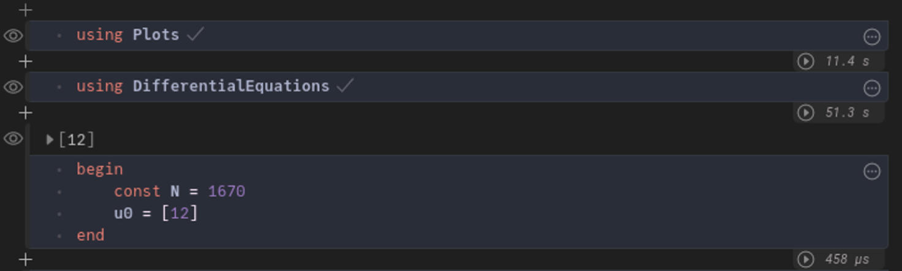{#fig:002 width=86%}

3. В следующей ячейке Pluto построим модель. При помощи 'DifferentialEquations' зададим и решим систему ДУ, после чего построим график решения и сохраним его. Далее запустим итоговый скрипт. (рис. @fig:003, @fig:004)

```Julia
alpha1 = 0.133
alpha2 = 0.000033
t = (0, 30)

function AD!(du, u, p, t)
  du[1] = (alpha1 + alpha2 * u[1]) * (N - u[1])
end

prob = ODEProblem(AD!, u0, t)
sol = solve(prob)

plt = plot(
  sol,
  dpi=500,
  size=(1024, 512),
  plot_title="Эффективность рекламы",
  xlabel="Время",
  ylabel="n(t)",
  label="n(t) - количество заинтересованных в товаре людей")

savefig(plt, "artifacts/JL.lab07-01.png")
println("Success")
```

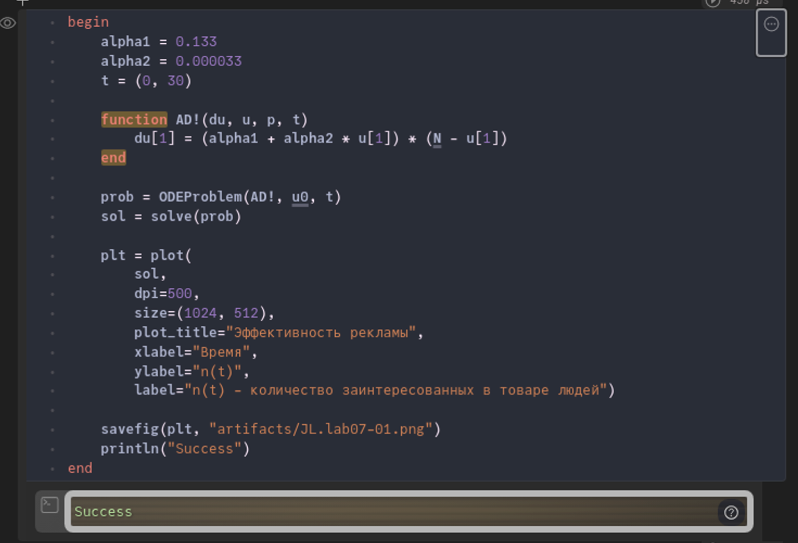{#fig:003 width=86%}

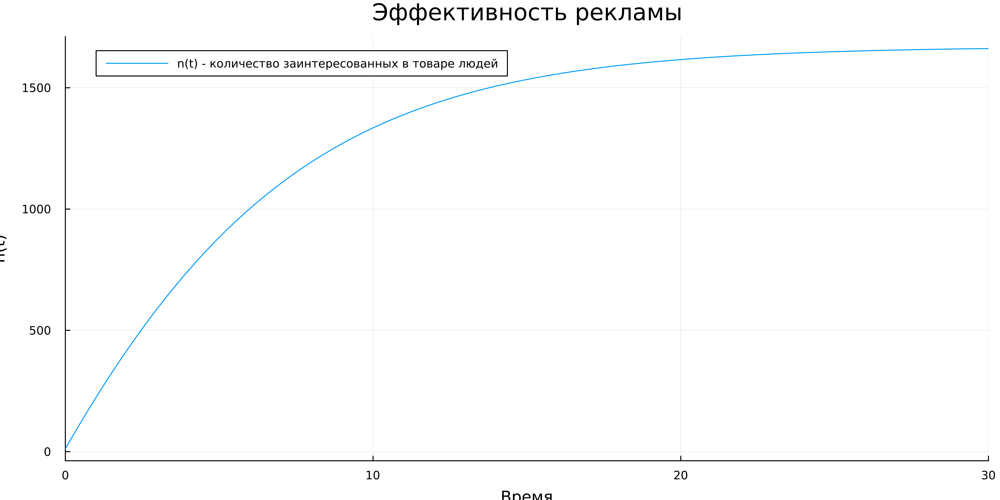{#fig:004 width=86%}

4. Изменим значения коэффициентов $\alpha$, так же модернизируем функцию системы, чтобы найти максимальное значение и будем сохранять его в заранне заданную переменную. После чего на графике реения системы отобразим точку, которая соответствует максимальной скорости распространения рекламы. (рис. @fig:005, @fig:006)

```Julia
alpha1 = 0.0000132 #!
alpha2 = 0.32 #!
t = (0, 0.02) #!
max_speed = [-1e12, 0, 0] #макс значение производной + (t и значение n(t))

function AD!(du, u, p, t)
  du[1] = (alpha1 + alpha2 * u[1]) * (N - u[1])
  if du[1] > max_speed[1]
    max_speed[1] = du[1]
    max_speed[2] = t
    max_speed[3] = u[1]
  end
end

prob = ODEProblem(AD!, u0, t)
sol = solve(prob)

plt = plot(
  sol,
  dpi=500,
  size=(1024, 512),
  plot_title="Эффективность рекламы",
  xlabel="Время",
  ylabel="n(t)",
  label="количество заинтересованных в товаре людей")

scatter!(
  plt,
  [max_speed[2]],
  [max_speed[3]],
  seriestype=:scatter,
  label="максимальное значение cкорости распространения рекламы")

savefig(plt, "artifacts/JL.lab07-02.png")
println(max_speed)
println("Success")
```

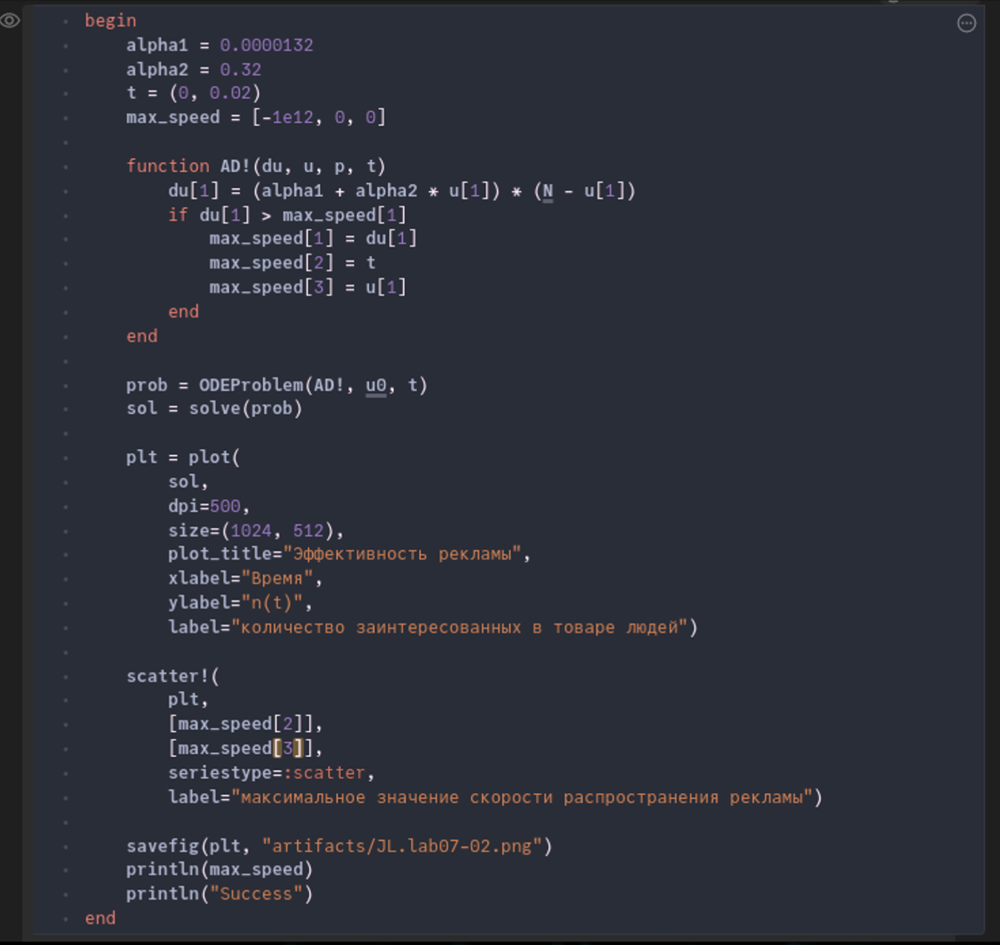{#fig:005 width=86%}

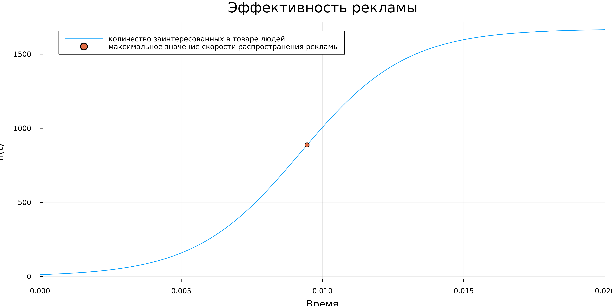{#fig:006 width=86%}

6. Изменим скрипт 1го кейса, а именно поменяем $\alpha$, промежуток времени, а также изменим функцию в соотвествии с задачей. (рис. @fig:007, @fig:008)

```Julia
alpha1 = 0.8
alpha2 = 0.15
t = (0, 0.4)

function AD!(du, u, p, t)
  du[1] = (alpha1 * t + alpha2 * sin(t) * u[1]) * (N - u[1])
end

prob = ODEProblem(AD!, u0, t)
sol = solve(prob)

plt = plot(
  sol,
  dpi=500,
  size=(1024, 512),
  plot_title="Эффективность рекламы",
  xlabel="Время",
  ylabel="n(t)",
  label="n(t) - количество заинтересованных в товаре людей")

savefig(plt, "artifacts/JL.lab07-03.png")
println("Success")
```

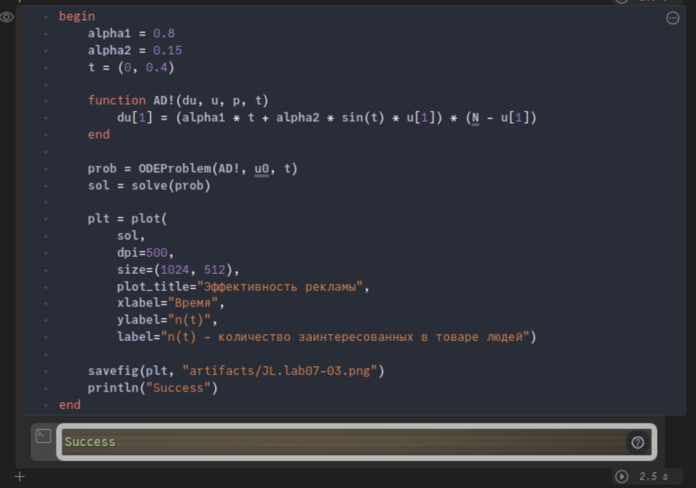{#fig:007 width=86%}

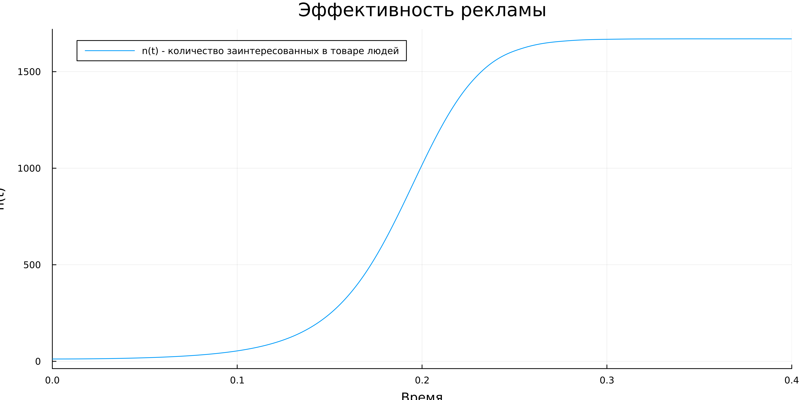{#fig:008 width=86%}

7. Напишем скрипт на modellica для решения 1-ой задачи. После чего запустим его и сохраним график. (рис. @fig:009, @fig:010)

```modelica
model lab07_1
  constant Integer N = 1670;
  constant Real alpha1 = 0.133;
  constant Real alpha2 = 0.000033;
  Real t = time;
  Real n(t);
initial equation
    n = 12;
equation
  der(n) = (alpha1 + alpha2 * n) * (N - n);
  annotation(experiment(StartTime = 0, StopTime = 30, Interval = 0.001));
end lab07_1;
```

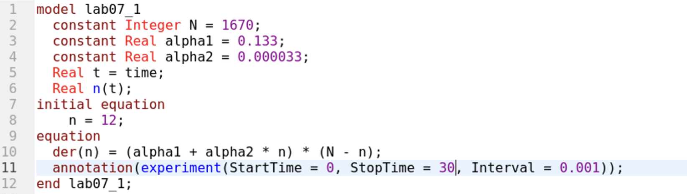{#fig:009 width=86%}

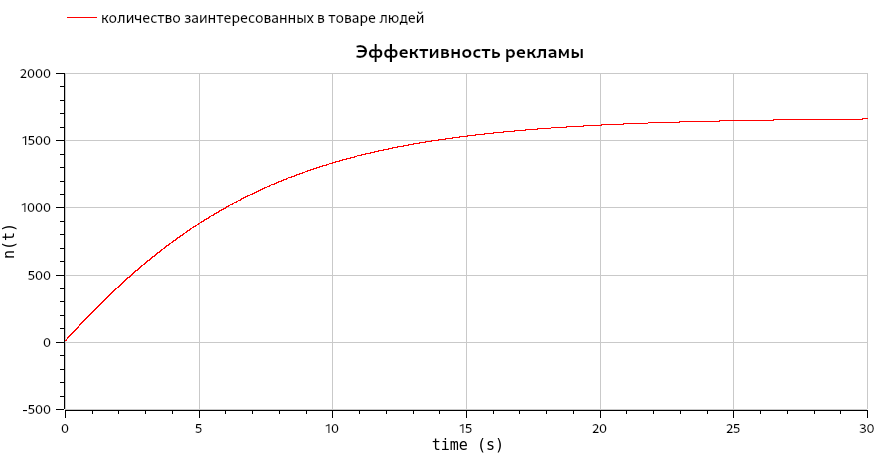{#fig:010 width=86%}

8. Напишем скрипт на modellica для решения 2-ой задачи: изменим начальные значения. После чего запустим его и сохраним график. (рис. @fig:011, @fig:012)

```modelica
model lab07_2
  constant Integer N = 1670;
  constant Real alpha1 = 0.0000132;
  constant Real alpha2 = 0.32;
  Real t = time;
  Real n(t);
initial equation
    n = 12;
equation
  der(n) = (alpha1 + alpha2 * n) * (N - n);
  annotation(experiment(StartTime = 0, StopTime = 0.02, Interval = 0.001));
end lab07_2;
```

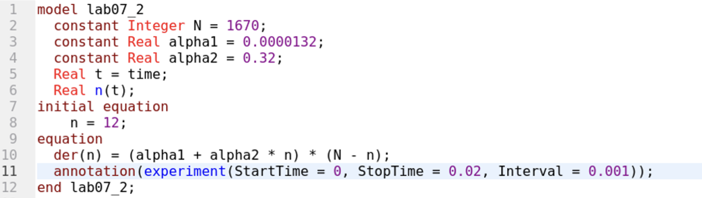{#fig:011 width=86%}

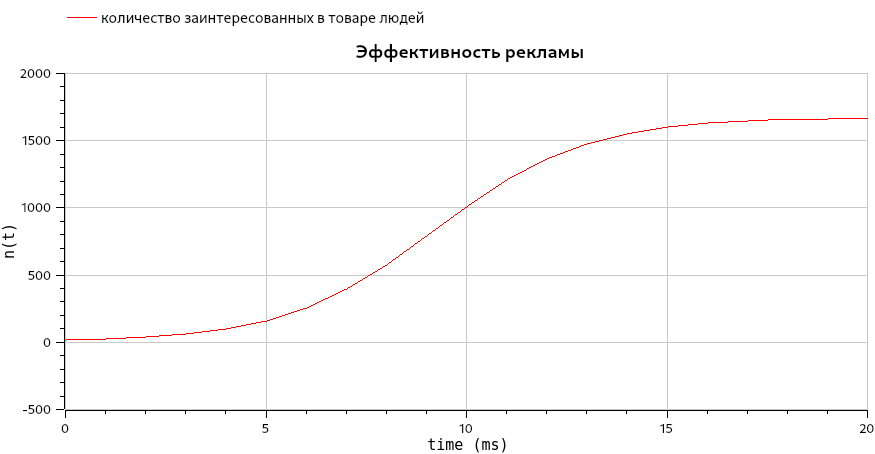{#fig:012 width=86%}

9. Напишем скрипт на modellica для решения 3-ой задачи: изменим начальные значения, а также уравнение. После чего запустим его и сохраним график. (рис. @fig:013, @fig:014)

```modelica
model lab07_3
  constant Integer N = 1670;
  constant Real alpha1 = 0.8;
  constant Real alpha2 = 0.15;
  Real t = time;
  Real n(t);
initial equation
    n = 12;
equation
  der(n) = (alpha1 * t + alpha2 * sin(t) * n) * (N - n);
  annotation(experiment(StartTime = 0, StopTime = 0.4, Interval = 0.001));
end lab07_3;
```

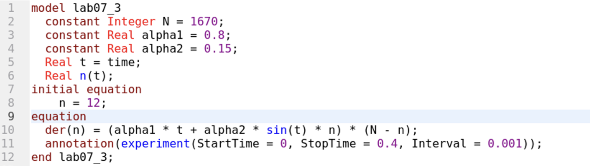{#fig:013 width=86%}

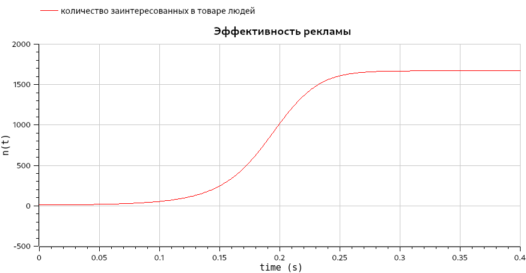{#fig:014 width=86%}

# Анализ результатов

Работа выполненна без непредвиденных проблем в соответствии с руководством. Ошибок и сбоев не произошло.

Моделирование на OMEdit было проще и быстрее, чем при использовании средств Julia. Скрипт на Modelica вышел более лакончиным, понятным и коротким. Более того OpenModelica быстрее обрабатывала скрипт и симмулировала модель. Стоит отметить, что OpenModelica имеет множество разлиных полезных инструментов для настройки с симмуляцией и работой с ней.

К плюсам Julia можно отнести, что она является языком программирования, который хорошо подходит для математических и технических задач. Отметим, что скрипт на Julia выполняется долго из-за подключения пакетов, каждый раз при его запуске. При использовании Pluto, нет необходимости каждый раз с нуля выполнять скрипт, таким образом скорость выполнения может даже превышать скорость моделирования в OMEdit.

# Выводы

Мы улучшили практические навыки в области дифференциальных уравнений, улучшили навыки моделирования на Julia, а также навыки моделирования на OpenModelica. Изучили и построили модель распространения рекламы.

# Список литературы{.unnumbered}

::: {#refs}
:::
