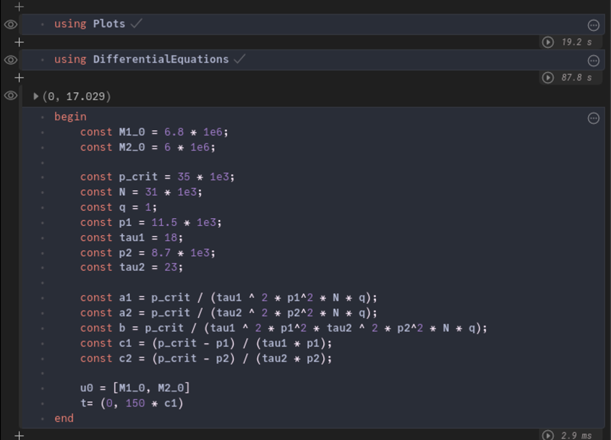

---
## Front matter
title: "Лабораторная работа №8"
subtitle: "Модель конкуренции двух фирм"
author: Ибрагимов Улугбек Ботырхонович

## Generic otions
lang: ru-RU
toc-title: "Содержание"

## Bibliography
bibliography: bib/cite.bib
csl: pandoc/csl/gost-r-7-0-5-2008-numeric.csl

## Pdf output format
toc: true # Table of contents
toc-depth: 2
lof: true # List of figures
lot: false # List of tables
fontsize: 12pt
linestretch: 1.5
papersize: a4
documentclass: scrreprt
## I18n polyglossia
polyglossia-lang:
  name: russian
  options:
	- spelling=modern
	- babelshorthands=true
polyglossia-otherlangs:
  name: english
## I18n babel
babel-lang: russian
babel-otherlangs: english
## Fonts
mainfont: PT Serif
romanfont: PT Serif
sansfont: PT Sans
monofont: PT Mono
mainfontoptions: Ligatures=TeX
romanfontoptions: Ligatures=TeX
sansfontoptions: Ligatures=TeX,Scale=MatchLowercase
monofontoptions: Scale=MatchLowercase,Scale=0.9
## Biblatex
biblatex: true
biblio-style: "gost-numeric"
biblatexoptions:
  - parentracker=true
  - backend=biber
  - hyperref=auto
  - language=auto
  - autolang=other*
  - citestyle=gost-numeric
## Pandoc-crossref LaTeX customization
figureTitle: "Рис."
tableTitle: "Таблица"
listingTitle: "Листинг"
lofTitle: "Список иллюстраций"
lotTitle: "Список таблиц"
lolTitle: "Листинги"
## Misc options
indent: true
header-includes:
  - \usepackage{indentfirst}
  - \usepackage{float} # keep figures where there are in the text
  - \floatplacement{figure}{H} # keep figures where there are in the text
---

# Цель работы

Рассмотреть модель конкуренции двух фирм. Построить вышеуказанную модель средствами OpenModellica и Julia.

# Задачи

1. Построить графики изменения оборотных средств фирмы 1 и фирмы 2 без учета постоянных издержек и с веденной нормировкой для случая 1.

2. Построить графики изменения оборотных средств фирмы 1 и фирмы 2 без учета постоянных издержек и с веденной нормировкой для случая 2.

Нормировка: $t = c_1\theta$

Начальные условия и параметры: $M_0^1 = 6.8$, $M_0^2= 6$, $p_{cr} = 35$, $N = 31$, $q = 1$, $\tau_1 = 18$, $\tau_2 = 23$, $p_1 = 1.5$, $p_2 = 8.7$

Значения $p_{cr}, p_{1,2}, N$ указаны в тысячах единиц, а значения $M_{1,2}$ указаны в млн. единиц.

# Среда

-   Julia – это открытый свободный высокопроизводительный динамический язык высокого уровня, созданный специально для технических (математических) вычислений. Его синтаксис близок к синтаксису других сред технических вычислений, таких как Matlab и Octave. [@unn-julia]

-   OpenModelica — свободное открытое программное обеспечение для моделирования, симуляции, оптимизации и анализа сложных динамических систем. Основано на языке Modelica. [@wiki-om]

# Теоретическое введение

## Случай I

Рассмотрим две фирмы, производящие взаимозаменяемые товары одинакового качества и находящиеся в одной рыночной нише. Считаем, что в рамках нашей модели конкурентная борьба ведётся только рыночными методами. То есть, конкуренты могут влиять на противника путем изменения параметров своего производства: себестоимость, время цикла, но не могут прямо вмешиваться в ситуацию на рынке («назначать» цену или влиять на потребителей каким-либо иным способом.) Будем считать, что постоянные издержки пренебрежимо малы, и в модели учитывать не будем. В этом случае динамика изменения объемов продаж фирмы 1 и фирмы 2 описывается следующей системой уравнений:[@rudn-task]

$$
\begin{cases}
\frac{dM_1}{d\theta} = M_1 - \frac{b}{c_1}M_1M_2 - \frac{a_1}{c_1}M_1^2\\
\frac{dM_2}{d\theta} = \frac{c_2}{c_1}M_2 - \frac{b}{c_1}M_1M_2 - \frac{a_2}{c_1}M_2^2 \\
\end{cases}
$$

## Случай II

Рассмотрим модель, когда, помимо экономического фактора влияния (изменение себестоимости, производственного цикла, использование кредита и т.п.), используются еще и социально-психологические факторы – формирование общественного предпочтения одного товара другому, не зависимо от их качества и цены. В этом случае взаимодействие двух фирм будет зависеть друг от друга, соответственно коэффициент перед $M_1M_2$ будет отличаться. Пусть в рамках рассматриваемой модели динамика изменения объемов продаж фирмы 1 и фирмы 2 описывается следующей системой уравнений:

$$
\begin{cases}
\frac{dM_1}{d\theta} = M_1 - (\frac{b}{c_1} + 0.00067)M_1M_2 - \frac{a_1}{c_1}M_1^2\\
\frac{dM_2}{d\theta} = \frac{c_2}{c_1}M_2 - \frac{b}{c_1}M_1M_2 - \frac{a_2}{c_1}M_2^2 \\
\end{cases}
$$

В обоих случаях:
$a_1 = \frac{p_{cr}}{\tau_1^2p_1^2Nq}$, $a_2 = \frac{p_{cr}}{\tau_2^2p_2^2Nq}$, $b = \frac{p_{cr}}{\tau_1^2p_1^2\tau_2^2p_2^2Nq}$, $c_1 = \frac{p_{cr} - p_1}{\tau_1p_1}$, $c_2 = \frac{p_{cr} - p_2}{\tau_2p_2}$.

# Выполнение лабораторной работы

1. Начнем выполнения поставленных задач в Julia. Для этого запустим Pluto [@pluto-jl]. (рис. @fig:001)

{#fig:001 width=86%}

2. Первым делом подкючим пакеты "Plots" [@docs-plots] и "DifferentialEquations" [@docs-de]. Далее объявим начальные данные верные для всех кейсов при помощи констант. Также объявим начальное условие для системы ДУ. (рис. @fig:002)

```Julia
# подключение пакетов
using Plots
using DifferentialEquations

# входные данные
const M1_0 = 6.8 * 1e6;
const M2_0 = 6 * 1e6;

const p_crit = 35 * 1e3;
const N = 31 * 1e3;
const q = 1;
const p1 = 11.5 * 1e3;
const tau1 = 18;
const p2 = 8.7 * 1e3;
const tau2 = 23;

const a1 = p_crit / (tau1 ^ 2 * p1^2 * N * q);
const a2 = p_crit / (tau2 ^ 2 * p2^2 * N * q);
const b = p_crit / (tau1 ^ 2 * p1^2 * tau2 ^ 2 * p2^2 * N * q);
const c1 = (p_crit - p1) / (tau1 * p1);
const c2 = (p_crit - p2) / (tau2 * p2);

u0 = [M1_0, M2_0]
t = (0, 150 * c1)
```

{#fig:002 width=86%}

3. В следующей ячейке Pluto построим модель. При помощи 'DifferentialEquations' зададим и решим систему ДУ, после чего построим график решения и сохраним его. Далее запустим итоговый скрипт. После чего изменим коэффициент и также запустим скрипт. (рис. @fig:003, @fig:004, @fig:005)

```Julia
case = "1"; k = 0;
# case = "2"; k = 0.00067;

function VS!(du, u, p, t)
    du[1] = u[1] - (b / c1 + k) * u[1] * u[2] - a1 / c1 * u[1] ^ 2;
    du[2] = c2 / c1 * u[2] - (b / c1) * u[1] * u[2] - a2 / c1 * u[2] ^ 2;
end

prob = ODEProblem(VS!, u0, t)
sol = solve(prob)

plt = plot(
  sol,
  dpi=500,
  size=(1024, 512),
  plot_title="Модель конкуренции двух фирм. Случай " * case,
  xlabel="t / c1",
  ylabel="M1(t), M2(t)",
  label=["M1 - оборотные средства предприятия #1" "M2 - оборотные средства предприятия #2"])

savefig(plt, "artifacts/JL.lab08-0" * case * ".png")
println("Success")
```

{#fig:003 width=86%}

{#fig:004 width=86%}

{#fig:005 width=86%}

7. Напишем скрипт на modellica для решения 1-ой задачи. После чего запустим его и сохраним график. (рис. @fig:006, @fig:007)

```modelica
model lab08_1
  constant Real M1_0 = 6.8 * 1e6;
  constant Real M2_0 = 6 * 1e6;

  constant Integer p_crit = 35 * integer(1e3);
  constant Integer N = 31 * integer(1e3);
  constant Integer q = 1;
  constant Real p1 = 11.5 * integer(1e3);
  constant Integer tau1 = 18;
  constant Real p2 = 8.7 * integer(1e3);
  constant Integer tau2 = 23;

  constant Real a1 = p_crit / (tau1 ^ 2 * p1^2 * N * q);
  constant Real a2 = p_crit / (tau2 ^ 2 * p2^2 * N * q);
  constant Real b = p_crit / (tau1 ^ 2 * p1^2 * tau2 ^ 2 * p2^2 * N * q);
  constant Real c1 = (p_crit - p1) / (tau1 * p1);
  constant Real c2 = (p_crit - p2) / (tau2 * p2);

  Real t = time / c1;
  Real M1(t);
  Real M2(t);
initial equation
    M1 = M1_0;
    M2 = M2_0;
equation
  der(M1) = M1 - (b / c1) * M1 * M2 - a1 / c1 * M1 ^ 2;
  der(M2) = c2 / c1 * M2 - (b / c1) * M1 * M2 - a2 / c1 * M2 ^ 2;
  annotation(experiment(StartTime = 0, StopTime = 15, Interval = 0.01));
end lab08_1;

```

{#fig:006 width=86%}

{#fig:007 width=86%}

8. Напишем скрипт на modellica для решения 2-ой задачи: изменим ДУ. После чего запустим его и сохраним график. (рис. @fig:008, @fig:009)

```modelica
model lab08_2
  constant Real M1_0 = 6.8 * 1e6;
  constant Real M2_0 = 6 * 1e6;

  constant Integer p_crit = 35 * integer(1e3);
  constant Integer N = 31 * integer(1e3);
  constant Integer q = 1;
  constant Real p1 = 11.5 * integer(1e3);
  constant Integer tau1 = 18;
  constant Real p2 = 8.7 * integer(1e3);
  constant Integer tau2 = 23;

  constant Real a1 = p_crit / (tau1 ^ 2 * p1^2 * N * q);
  constant Real a2 = p_crit / (tau2 ^ 2 * p2^2 * N * q);
  constant Real b = p_crit / (tau1 ^ 2 * p1^2 * tau2 ^ 2 * p2^2 * N * q);
  constant Real c1 = (p_crit - p1) / (tau1 * p1);
  constant Real c2 = (p_crit - p2) / (tau2 * p2);

  Real t = time / c1;
  Real M1(t);
  Real M2(t);
initial equation
    M1 = M1_0;
    M2 = M2_0;
equation
  der(M1) = M1 - (b / c1 + 0.00067) * M1 * M2 - a1 / c1 * M1 ^ 2;
  der(M2) = c2 / c1 * M2 - (b / c1) * M1 * M2 - a2 / c1 * M2 ^ 2;
  annotation(experiment(StartTime = 0, StopTime = 15, Interval = 0.01));
end lab08_2;

```

{#fig:008 width=86%}

{#fig:009 width=86%}

# Анализ результатов

Работа выполненна без непредвиденных проблем в соответствии с руководством. Ошибок и сбоев не произошло.

Моделирование на OMEdit было проще и быстрее, чем при использовании средств Julia. Скрипт на Modelica вышел более лакончиным, понятным и коротким. Более того OpenModelica быстрее обрабатывала скрипт и симмулировала модель. Стоит отметить, что OpenModelica имеет множество разлиных полезных инструментов для настройки с симмуляцией и работой с ней.

К плюсам Julia можно отнести, что она является языком программирования, который хорошо подходит для математических и технических задач. Отметим, что скрипт на Julia выполняется долго из-за подключения пакетов, каждый раз при его запуске. При использовании Pluto, нет необходимости каждый раз с нуля выполнять скрипт, таким образом скорость выполнения может даже превышать скорость моделирования в OMEdit.

# Выводы

Мы улучшили практические навыки в области дифференциальных уравнений, улучшили навыки моделирования на Julia, а также навыки моделирования на OpenModelica. Изучили и построили модель конкуренции двух фирм.

# Список литературы{.unnumbered}

::: {#refs}
:::
